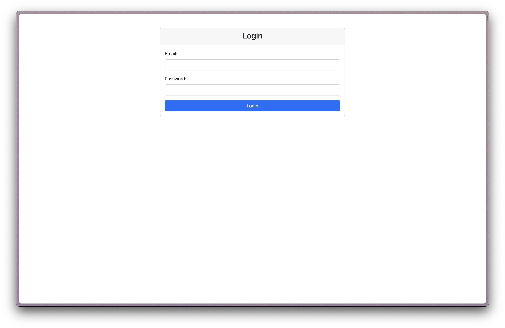
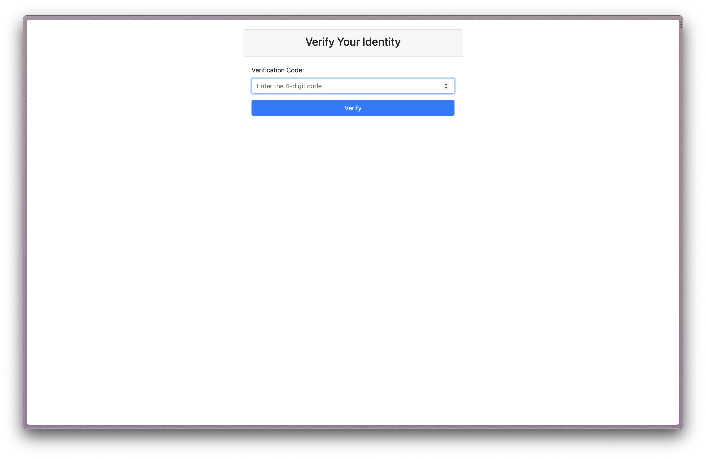
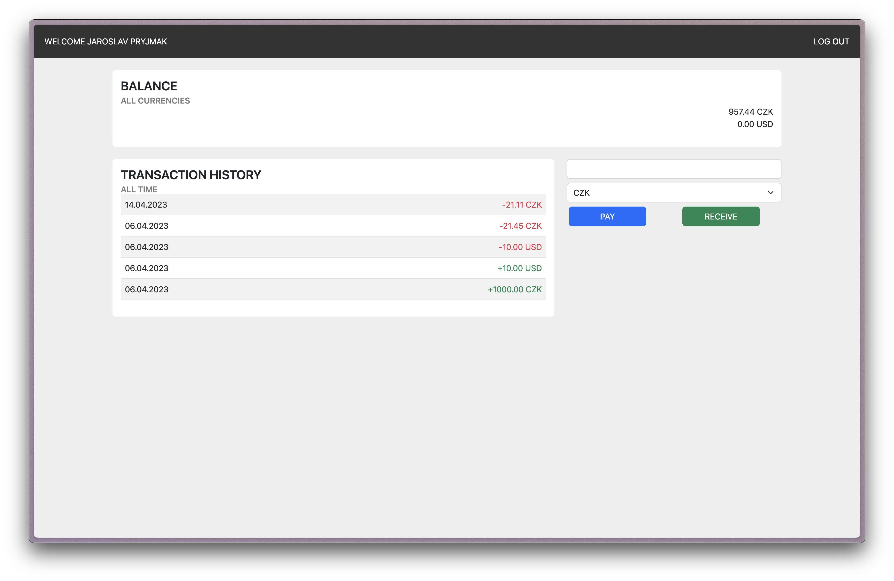

# Bank App mockup
This repository contains the source code for a banking application designed to provide clients with account information.

The project consists of a client-side and a server-side component. The client-side allows the user to display account balance and transaction history. The server-side manages transactions and currency conversions.

## Application Requirements

The application is compatible with both PCs and mobile devices. For the application to function properly, it is recommended to use browsers such as Google Chrome (v. 110.0.5464.58 or newer), Mozilla Firefox (v. 103.0.5 or newer), Microsoft Edge (v. 110.0.5464.58 or newer), or Apple Safari (v. 15.3.1 or newer).

## Features

### Client-side

The client-side allows the user to log into the application using a username/email and password, with two-factor authentication for increased security. After successful login, the user is allowed to view the current account balance in various currencies and transaction history. The user can also make payments in multiple currencies.

### Server-side

The server-side manages some of the user inputs. 

- **Login**: This is done by entering the user's email and password, followed by two-factor authentication: the server checks if the login details are correct. If so, it sends a freshly generated code, valid for 5 minutes, to the user's email, which the user enters in the application.

- **Generating Payments and Receipts**: The user enters the amount and currency they want to send or receive. The server processes the request based on the selected action. Currency conversions during payments use live rates obtained from the Czech National Bank's website.

- **Balance Statement**: The server has the balance saved and will print it immediately after the user logs in. In the case of transactions, it will perform the operation (add / deduct the amount) and update the balance.

- **Transaction History Statement**: After each payment or receipt, the server will add the value, currency, and date of the transaction to the statement.

## Error Handling

- **Loss of Connection**: Loss of connection on the part of the server: the server is unable to load content or does not respond, an error message about the loss of connection is displayed to the user, the user must wait, the message disappears after reconnecting.
- **Unavailable Currency Rates**: This error can occur if: The Czech National Bank's website is not available, the server loses its internet connection, the Czech National Bank changes the format of the provided statement in the text file compared to the current form.

